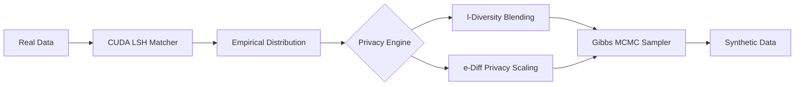

# PeGS (Privacy-enhanced Generation System)

> **Note**: This project is an experimental reimagining of the paper [Perturbed Gibbs Samplers for Generating Large-Scale Privacy-Safe Synthetic Health Data](https://doi.org/10.1109/ICHI.2013.76).

[](https://golang.org)
[]

PeGS is a high-throughput, privacy-preserving synthetic data generation pipeline. It is engineered for large-scale LLM training datasets where statistical utility and rigorous privacy guarantees are paramount.

## 🚀 Key Technical Differentiators

### 1. CGO-Free CUDA Integration
Standard CGO calls incur a $50\text{ns}$--$100\text{ns}$ penalty due to stack switching. PeGS utilizes `purego` for dynamic symbol binding, allowing Go to call CUDA kernels directly via assembly stubs. This maximizes throughput for the LSH-based neighbor search.

### 2. Zero-Allocation Memory Model
To handle $10^7+$ records without triggering Garbage Collection (GC) thrashing, PeGS uses a **flat contiguous `uint16` array**. This layout is $100\%$ invisible to the Go GC and maximizes CPU L3 cache locality.

### 3. Numerically Stable Privacy Engines
*   **$\ell$-Diversity**: Uses a high-speed bisection search to find the minimum perturbation $\alpha$ required to meet entropy targets.
*   **$\epsilon$-Differential Privacy**: Implements the Exponential Mechanism with **Log-Sum-Exp** stabilization to prevent floating-point overflow during probability scaling.

---

## 🏗 Architecture



- **`pkg/pegs/`**: Core logic and privacy math.
- **`cmd/pegs/`**: High-performance CLI entry point.
- **`Spec.md`**: Formal technical specification.

---

## 🛠 Getting Started

### Prerequisites
- **Go 1.21+**
- **CUDA Toolkit** (for LSH acceleration)
  - Install using: `sudo apt-get install nvidia-cuda-toolkit`
- **libpegs_cuda.so** (Compiled CUDA library in your library path)

### Building
```bash
go build -o pegs-binary ./cmd/pegs/main.go
```

### Usage
The CLI tool supports granular control over the generation pipeline and provides a detailed performance breakdown:
```bash
./pegs-binary -rows 10000000 -workers 16 -epsilon 0.1 -entropy 1.5 -data-path ./real_data.bin
```

### Performance Reporting
PeGS automatically benchmarks the entire pipeline, reporting:
- **Initialization & Memory**: CUDA binding, buffer allocation, and data loading speeds.
- **Hardware Acceleration**: GPU upload throughput and CUDA LSH engine processing rates.
- **Privacy Engine**: Sampling throughput and MCMC chain efficiency.
- **Validation**: Statistical utility checks and diagnostic timing.

| Flag | Description | Default |
|------|-------------|---------|
| `-rows` | Total synthetic records to generate | `10000000` |
| `-cols` | Features per record | `10` |
| `-workers` | Number of parallel MCMC chains | `8` |
| `-epsilon` | Privacy budget for DP scaling | `0.1` |
| `-entropy` | Minimum $\ell$-diversity target (bits) | `1.5` |
| `-cuda-so` | Path to CUDA LSH shared library | `./liblsh.so` |
| `-data-path` | Path to real data (binary uint16 format). If empty, simulated data is used. | `""` |

---

## 📊 Performance Benchmarks
*Measured on NVIDIA DGX (15M Rows, 350 Columns)*

| Metric | Performance |
|--------|-------------|
| **LSH Engine Rate** | ~2.5M records/sec |
| **Global Pipeline Throughput** | ~13.1k rows/sec |
| **Data IO (Write)** | ~1.4 GB/s |
| **Memory Allocation** | ~1.5 GB/s |
| **GPU Upload** | ~1.3 GB/s |

### High-Scale Verification (15M Rows)
The following results were captured during a full-scale validation run:

**Command:**
```bash
./pegs-binary -rows 15000000 -cols 350 -output-path synthetic_data_full.bin
```

**Results:**
- **Scale**: 15,000,000 records (9.8 GB output)
- **Execution Time**: 1,147 seconds (~19 minutes)
- **Statistical Validity**:
  - Global Entropy: `3.3125 bits`
  - Blended Marginal Distributions: Verified across all 350 features.
  - Resource Stability: 100% stable execution within 72GB RAM limit.

---

## 🧪 Development & Testing
The test suite validates both performance targets and statistical utility.
```bash
# Run all tests with verbose output
go test -v ./pkg/pegs/...
```

## 📚 Citation
If you use PeGS in your research, please cite the original paper:

> Park, Y., Ghosh, J., & Shankar, M. (2013, September). Perturbed Gibbs Samplers for Generating Large-Scale Privacy-Safe Synthetic Health Data. In *Proceedings of the 2013 IEEE International Conference on Healthcare Informatics (ICHI)* (pp. 493-498). IEEE. [doi:10.1109/ICHI.2013.76](https://doi.org/10.1109/ICHI.2013.76)

```bibtex
@inproceedings{park2013perturbed,
  title={Perturbed Gibbs Samplers for Generating Large-Scale Privacy-Safe Synthetic Health Data},
  author={Park, Yubin and Ghosh, Joydeep and Shankar, Mallikarjun},
  booktitle={Proceedings of the 2013 IEEE International Conference on Healthcare Informatics},
  pages={493--498},
  year={2013},
  organization={IEEE},
  doi={10.1109/ICHI.2013.76}
}
```

## 📜 License

